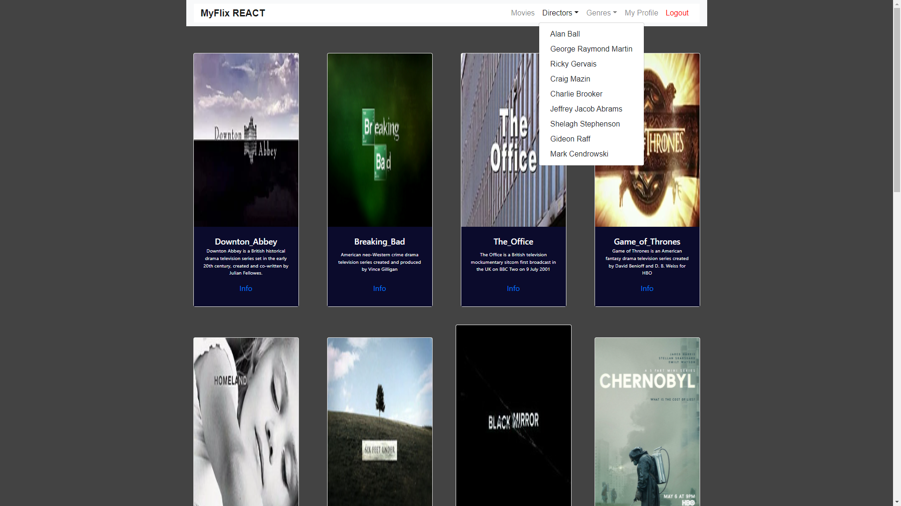

# myFlix React

 

 Create the client-side component of a movie web application which will provide users with access to information about different movies, directors, and genres. Users will also be able to sign up, update their personal information, and create a list of their favorite movies.

## Languages used
- HTML
- CSS
- Javascript
- MERN stack
- JSX
- React
- React Bootstrap
- React Redux

## Creator
- [Github](https://github.com/cicciotazza)
- Linkedin (to be filled)
  
## Tools used
- Parcel
- Visual Studio Code
- GitHub Desktop
- Windows PowerShell 

## **Dependencies**
```
 "axios": "^0.21.1"
 "img": "^3.0.3"
 "moment": "^2.29.1"
 "p": "^0.2.0"
 "parcel-bundler": "^1.12.5"
 "path": "^0.12.7"
 "prop-types": "^15.7.2"
 "public": "^0.1.5"
 "react": "^17.0.2"
 "react-bootstrap": "^1.6.1"
 "react-dom": "^17.0.2"
 "react-r": "^2.0.0-rc02"
 "react-redux": "^7.2.5"
 "react-router-dom": "^5.2.1"
 "redux": "^4.1.1"
 "redux-devtools-extension": "^2.13.9"
 "s": "^1.0.0"
 "src": "^1.1.2"
```

## **How to run the app locally**
To build the project in the terminal, run `parcel src/index.html`  
Open webpage and use, `http://localhost:1234/`
  
## Exercises
**Task01**
*1. Intro to Frameworks & Libraries*

**Task02**
*Building with Javascript*

**Task03**
*React Components & the Virtual DOM*

**Task04**
*Advanced React*

**Task05**
*React Bootstrap*

**Task06**
*Client-side app routing*

**Task07**
*Introduction to Redux*

**Task08**
*React Redux*